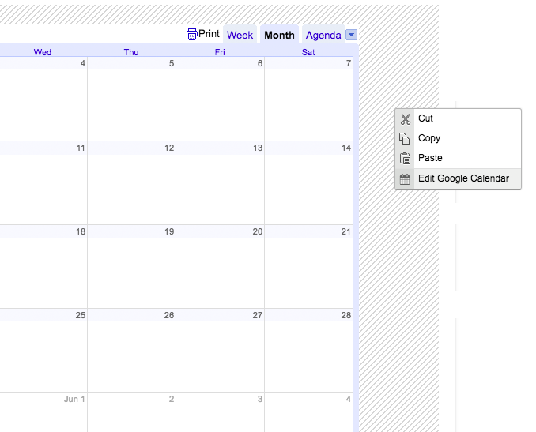

# ckeditor-calendar

> Insulate Google Calendar iframes with a contextMenu-friendly div

This plugin works as a simple Google Calendar embed plugin, with a twist: it wraps all iframe embeds with a div tag. This means that even
iframes that hijack the right-click can have ckeditor contextMenus attached to them. 


## Installation

**Step 1:** Copy the calendar plugin files to your CKEditor's plugin folder:
```
ckeditor/plugins/
```

**Step 2:** Add the plugin to the CKEDITOR configuration:
```js
CKEDITOR.config.extraPlugins = 'calendar';
```

**Step 3:** Ensure that this plugin can create content:
```js
CKEDITOR.config.allowedContent = true;
```

**Step 4:** For best results, disable the default `iframe` plugin:
```js
CKEDITOR.config.removePlugins = 'iframe';
```

## Usage

Once installed, you can use the new Embed Google Calendar button in the Insert toolbar


Or, right-click the "pinstripe" area to access the "Edit Google Calendar" Context Menu. The pinstripes are only shown in the editor 
pane to help you see your iframe area. This is what makes it possible to attach contextMenus to iframes that hijack the right-click,
because the right-click is technically attached to the iframe's insulating div. 



## Notes

This plugin wraps your iframe embeds with a div that looks like this:

```html
<div class="calendar-insulator">
    <iframe>...</iframe>
</div>
```

No styles are attached to the `div.calendar-insulator` outside of the editor, so you are free to style it however you like,
or ignore it all together. 

## Related 

- [ckeditor-audioinsulator](https://github.com/radiovisual/ckeditor-audioinsulator)
- [ckeditor-iframeinsulator](https://github.com/radiovisual/ckeditor-iframeinsulator)

## License

MIT @ [Michael Wuergler](http://numetriclabs.com)
